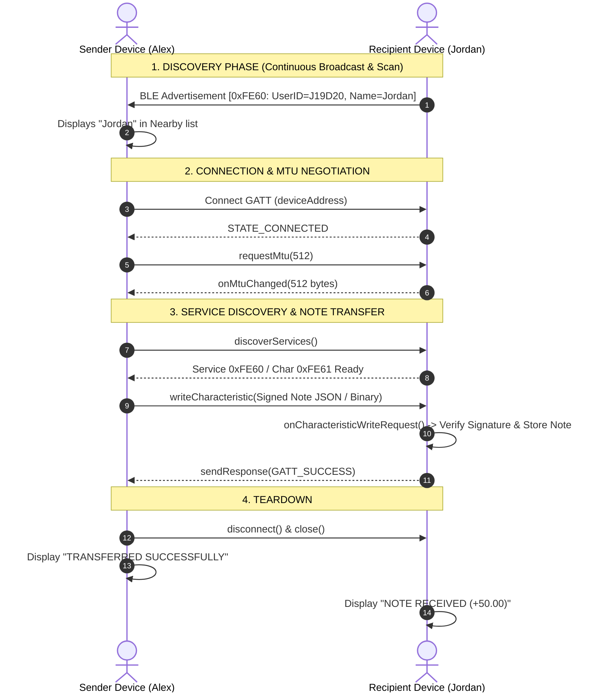

# Bluetooth Low Energy (BLE) Direct Packet Transfer Architecture
### Complete Engineering Reference for Phone-to-Phone Offline Messaging & Cryptographic Token/Note Transfer

> **Target Audience:** Engineers, Architects, and AI Agents building zero-internet, device-to-device offline communication, offline digital payments, or cryptographic note ownership transfer systems.

---

## 1. Executive Summary & Offline Payment Use Case

In offline payment systems, two devices (Sender and Receiver) must exchange a cryptographically signed payload (e.g. server-signed cash note, offline voucher, or ownership token) without internet access.

### Why BLE Replaces Multi-Step QR Codes:
- **QR Code Bottleneck:** Large cryptographic payloads with signatures exceed standard single-frame QR capacity, forcing users to repeatedly scan animated/multi-frame QR codes back and forth.
- **BLE Solution:** With Bluetooth Low Energy, devices discover each other automatically within 10–30 meters, establish a direct 1-to-1 link, negotiate a 512-byte MTU, and transfer complete signed notes in milliseconds with a single tap.

---

## 2. Core BLE Architecture (Phone-to-Phone Model)

Unlike phone-to-smartwatch or phone-to-beacon communication, **Phone-to-Phone BLE requires both devices to operate in Dual Roles simultaneously**:

```
┌────────────────────────────────────────────────────────┐       ┌────────────────────────────────────────────────────────┐
│                        PHONE A                         │       │                        PHONE B                         │
│  ┌────────────────────────┐┌────────────────────────┐  │       │  ┌────────────────────────┐┌────────────────────────┐  │
│  │     PERIPHERAL ROLE    ││      CENTRAL ROLE      │  │  BLE  │  │     PERIPHERAL ROLE    ││      CENTRAL ROLE      │  │
│  │ (Advertiser + GATT Svr)││   (Scanner + Client)   │  │ <===> │  │ (Advertiser + GATT Svr)││   (Scanner + Client)   │  │
│  └────────────────────────┘└────────────────────────┘  │       │  └────────────────────────┘└────────────────────────┘  │
└────────────────────────────────────────────────────────┘       └────────────────────────────────────────────────────────┘
```

### Key Roles Defined:
1. **Peripheral Role (Advertiser & GATT Server):**
   - Broadcasts the device presence into the air using `BluetoothLeAdvertiser`.
   - Hosts a `BluetoothGattServer` with a custom **Service UUID** and writable **Characteristic UUID** to receive incoming bytes.
2. **Central Role (Scanner & GATT Client):**
   - Listens for nearby peripheral advertisements using `BluetoothLeScanner`.
   - Connects to the selected target device (`BluetoothGatt`), negotiates MTU, and writes the signed packet to the target's characteristic.

---

## 3. The 31-Byte Legacy Advertising Limit (CRITICAL GOTCHA)

> [!CAUTION]
> **The #1 Reason BLE Phone-to-Phone Discovery Fails:**
> Standard BLE advertising packets have a strict limit of **31 bytes total** (including flags, headers, and UUIDs). If the broadcast payload exceeds 31 bytes, Android’s Bluetooth stack throws `ADVERTISE_FAILED_DATA_TOO_LARGE` (Error Code 1) or silently drops the advertisement.

### How to Structure Advertising Packets Correctly:

```
┌──────────────────────────────────────────────────────────────────────────┐
│  PRIMARY ADVERTISING PACKET (Max 31 Bytes)                              │
├───────────────┬───────────────────────────────┬──────────────────────────┤
│ Flags (3 B)   │ 16-bit Service UUID (4 B)     │ Manufacturer Data (11 B) │
│ 0x02 0x01 0x06│ 0x03 0x03 0x60 0xFE (0xFE60)  │ "ZC:A7F29C" (User ID)    │
└───────────────┴───────────────────────────────┴──────────────────────────┘

┌──────────────────────────────────────────────────────────────────────────┐
│  SCAN RESPONSE PACKET (Secondary 31 Bytes - requested by scanner)        │
├──────────────────────────────────────────────────────────────────────────┤
│ Manufacturer Data (0xFE61) -> "Alex" (Display Name / Wallet Alias)       │
└──────────────────────────────────────────────────────────────────────────┘
```

### Best Practice Rules for Advertising:
1. **Use 16-bit UUIDs for Advertising:** A 128-bit UUID takes 18 bytes. A 16-bit UUID (e.g. `0xFE60`) takes only 4 bytes.
2. **Never Put Full Notes/Tokens in the Advertisement:** Advertising is only for *discovery* (announcing User/Wallet ID and Name). The actual payment note transfer happens over the established GATT connection.
3. **Use Manufacturer Specific Data (`0xFE60` / `0xFE61`):** Fast to parse and avoids extra UUID overhead.

---

## 4. End-to-End Transfer Flow (Cryptographic Notes)



---

## 5. Native Android Implementation Guide (Kotlin)

### A. AndroidManifest.xml Configuration
```xml
<manifest xmlns:android="http://schemas.android.com/apk/res/android">
    <!-- Android 12+ (API 31+) Permissions -->
    <uses-permission android:name="android.permission.BLUETOOTH_SCAN" 
                     android:usesPermissionFlags="neverForLocation" />
    <uses-permission android:name="android.permission.BLUETOOTH_ADVERTISE" />
    <uses-permission android:name="android.permission.BLUETOOTH_CONNECT" />

    <!-- Android 6–11 Legacy Permissions -->
    <uses-permission android:name="android.permission.BLUETOOTH" />
    <uses-permission android:name="android.permission.BLUETOOTH_ADMIN" />
    <uses-permission android:name="android.permission.ACCESS_FINE_LOCATION" />
    <uses-permission android:name="android.permission.ACCESS_COARSE_LOCATION" />
</manifest>
```

### B. Peripheral Advertising (Broadcasting Identity)
```kotlin
val settings = AdvertiseSettings.Builder()
    .setAdvertiseMode(AdvertiseSettings.ADVERTISE_MODE_LOW_LATENCY)
    .setTxPowerLevel(AdvertiseSettings.ADVERTISE_TX_POWER_HIGH)
    .setConnectable(true)
    .setTimeout(0)
    .build()

val data = AdvertiseData.Builder()
    .setIncludeDeviceName(false)
    .setIncludeTxPowerLevel(false)
    .addServiceUuid(ParcelUuid(UUID.fromString("0000FE60-0000-1000-8000-00805F9B34FB")))
    .addManufacturerData(0xFE60, "WALLET:$walletId".toByteArray(StandardCharsets.UTF_8))
    .build()

val scanResponse = AdvertiseData.Builder()
    .addManufacturerData(0xFE61, displayName.toByteArray(StandardCharsets.UTF_8))
    .build()

advertiser.startAdvertising(settings, data, scanResponse, advertiseCallback)
```

### C. GATT Server (Receiving Signed Note Packets)
```kotlin
val gattServer = bluetoothManager.openGattServer(context, object : BluetoothGattServerCallback() {
    override fun onCharacteristicWriteRequest(
        device: BluetoothDevice,
        requestId: Int,
        characteristic: BluetoothGattCharacteristic,
        preparedWrite: Boolean,
        responseNeeded: Boolean,
        offset: Int,
        value: ByteArray?
    ) {
        if (characteristic.uuid == CHAR_UUID && value != null) {
            val payload = String(value, StandardCharsets.UTF_8)
            
            // Process cryptographic note transfer
            handleIncomingNote(payload)

            if (responseNeeded) {
                gattServer.sendResponse(device, requestId, BluetoothGatt.GATT_SUCCESS, offset, value)
            }
        }
    }
})

val service = BluetoothGattService(SERVICE_UUID, BluetoothGattService.SERVICE_TYPE_PRIMARY)
val writeChar = BluetoothGattCharacteristic(
    CHAR_UUID,
    BluetoothGattCharacteristic.PROPERTY_WRITE or BluetoothGattCharacteristic.PROPERTY_WRITE_NO_RESPONSE,
    BluetoothGattCharacteristic.PERMISSION_WRITE
)
service.addCharacteristic(writeChar)
gattServer.addService(service)
```

### D. Central Scanner (Discovering Nearby Wallets)
```kotlin
val scanSettings = ScanSettings.Builder()
    .setScanMode(ScanSettings.SCAN_MODE_LOW_LATENCY)
    .setReportDelay(0)
    .build()

scanner.startScan(null, scanSettings, object : ScanCallback() {
    override fun onScanResult(callbackType: Int, result: ScanResult?) {
        val record = result?.scanRecord ?: return
        val userBytes = record.getManufacturerSpecificData(0xFE60) ?: return
        val nameBytes = record.getManufacturerSpecificData(0xFE61)

        val walletId = String(userBytes, StandardCharsets.UTF_8).removePrefix("WALLET:")
        val name = nameBytes?.let { String(it, StandardCharsets.UTF_8) } ?: "Wallet $walletId"

        onWalletDiscovered(walletId, name, result.device.address, result.rssi)
    }
})
```

### E. Connecting & Sending the Signed Note Payload
```kotlin
device.connectGatt(context, false, object : BluetoothGattCallback() {
    override fun onConnectionStateChange(gatt: BluetoothGatt, status: Int, newState: Int) {
        if (newState == BluetoothProfile.STATE_CONNECTED) {
            // Step 1: Request 512-byte MTU for large cryptographic note transfer
            gatt.requestMtu(512)
        } else if (newState == BluetoothProfile.STATE_DISCONNECTED) {
            gatt.close()
        }
    }

    override fun onMtuChanged(gatt: BluetoothGatt, mtu: Int, status: Int) {
        // Step 2: Discover services once MTU is confirmed
        gatt.discoverServices()
    }

    override fun onServicesDiscovered(gatt: BluetoothGatt, status: Int) {
        val service = gatt.getService(SERVICE_UUID)
        val char = service?.getCharacteristic(CHAR_UUID)
        
        // Step 3: Write the signed note payload
        char?.value = signedNoteJson.toByteArray(StandardCharsets.UTF_8)
        gatt.writeCharacteristic(char)
    }

    override fun onCharacteristicWrite(gatt: BluetoothGatt, char: BluetoothGattCharacteristic, status: Int) {
        // Step 4: Confirm transmission and close connection cleanly
        gatt.disconnect()
        gatt.close()
        if (status == BluetoothGatt.GATT_SUCCESS) {
            onTransferComplete()
        }
    }
}, BluetoothDevice.TRANSPORT_LE)
```

---

## 6. Top 10 Pitfalls & Battle-Tested Solutions

| # | Common Pitfall | Why It Happens | Solution |
| :--- | :--- | :--- | :--- |
| **1** | `ADVERTISE_FAILED_DATA_TOO_LARGE` | Advertising payload exceeds 31 bytes. | Use 16-bit Service UUID (`0xFE60`) and compact Manufacturer Data. Put secondary info in `ScanResponse`. |
| **2** | Packet truncated at 20 bytes | Default BLE MTU is 23 bytes (3 bytes header = 20 bytes payload). | Call `gatt.requestMtu(512)` immediately upon `STATE_CONNECTED` before writing characteristics. |
| **3** | `GATT 133` Error (Connection failed) | Unclosed `BluetoothGatt` instances exhaust Android's 32-GATT client limit. | **Always** call `gatt.disconnect()` and `gatt.close()` in disconnect callbacks, timeouts, and error paths. |
| **4** | Scanner finds 0 devices on Android 10/11 | Android 6–11 enforces Location / GPS toggle for Bluetooth scanning. | Check `LocationManager.isProviderEnabled(GPS_PROVIDER)` and prompt user to enable Location on older Android. |
| **5** | Device unfindable when screen locks | Aggressive Android battery optimizations throttle background BLE. | Run scanning/advertising in foreground UI when payment screen is active. |
| **6** | Stale / Cached Bluetooth names | Android Bluetooth stack caches names by MAC address. | Parse identity directly from `ManufacturerSpecificData` rather than relying on cached `BluetoothDevice.name`. |
| **7** | Samsung / Xiaomi Chipset Drops | Overly strict hardware `ScanFilter` fails to match on some MediaTek/Exynos chips. | Use open scan with low latency and perform software validation in `onScanResult`. |
| **8** | Concurrency Collision | Two phones attempting to connect to each other at the exact same moment. | Design a unidirectional initiator: The **Payer (Sender)** initiates GATT Client connection to the **Payee (Receiver's GATT Server)**. |
| **9** | Missing Native Permissions on Android 12+ | `BLUETOOTH_SCAN` / `BLUETOOTH_ADVERTISE` not requested at runtime. | Request `PermissionsAndroid.requestMultiple([BLUETOOTH_SCAN, BLUETOOTH_ADVERTISE, BLUETOOTH_CONNECT])`. |
| **10** | Large Signature (>512 Bytes) | Payloads exceeding 512 bytes cannot fit in a single negotiated MTU frame. | Compress JSON (e.g. Protocol Buffers, MessagePack, or Gzip base64) or chunk data using sequence numbers. |

---

## 7. Recommended Data Schemas for Offline Payment Notes

### Signed Cash Note Packet Schema:
```json
{
  "type": "SIGNED_NOTE_TRANSFER",
  "packetId": "pkt_9a72df81c4",
  "noteId": "NOTE-2026-8841-A9F",
  "denomination": 50.00,
  "currency": "USD",
  "issuerSignature": "MEQCIB8...server_ecdsa_signature...",
  "previousOwner": "A7F29C",
  "newOwner": "J19D20",
  "transferTimestamp": 1788002400000,
  "transferSignature": "MEYCIQ...sender_private_key_signature..."
}
```

### Transfer Receipt / Acknowledgement Packet Schema:
```json
{
  "type": "TRANSFER_RECEIPT",
  "packetId": "ack_114c99e2",
  "noteId": "NOTE-2026-8841-A9F",
  "recipientWalletId": "J19D20",
  "status": "ACCEPTED",
  "receivedTimestamp": 1788002401200,
  "recipientSignature": "MEUCIE...recipient_acknowledgment_sig..."
}
```

---

## 8. Summary Checklist for Other AI / Engineering Teams

1. [x] **Dual Role Implementation**: Implement `BluetoothLeAdvertiser` + `BluetoothGattServer` on Payee and `BluetoothLeScanner` + `BluetoothGatt` on Payer.
2. [x] **Strict 31-Byte Rule**: Keep broadcast advertisement under 20 bytes using 16-bit UUID `0xFE60` and compact Manufacturer Data.
3. [x] **512-Byte MTU Negotiation**: Always call `gatt.requestMtu(512)` before writing payment note packets.
4. [x] **Directional Protocol**: Payer (Client) connects to Payee (Server) to prevent connection race conditions.
5. [x] **Strict GATT Teardown**: Always call `gatt.disconnect()` and `gatt.close()` after transmission to prevent `GATT 133` driver locks.
6. [x] **No Internet Dependency**: All cryptographic signature verification happens locally using public keys baked into the application or stored certificates.
